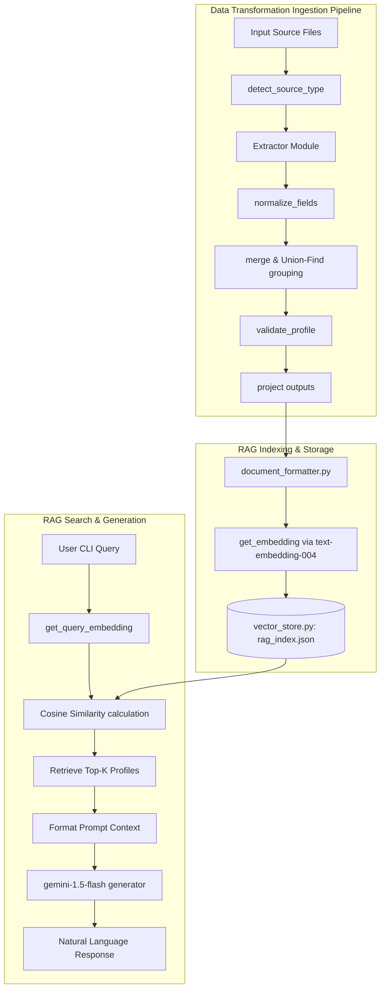

# Eightfold Multi-Source Candidate Data Transformer

A deterministic, explainable pipeline that ingests candidate data from multiple
heterogeneous sources and produces one clean, trustworthy, traceable canonical
profile per candidate.

**Assignment:** Eightfold Engineering Intern (Jul–Dec 2026) — Multi-Source Candidate Data Transformer

---

## Quick Start

### 1. Install dependencies

```bash
pip install -r requirements.txt
```

### 2. Run the pipeline

```bash
# Full canonical output (all fields, default schema)
python main.py --inputs data/sample_recruiter.csv data/sample_ats.json --verbose

# With a GitHub profile
python main.py --inputs data/sample_recruiter.csv data/sample_ats.json \
               --github-url https://github.com/Ajaybalaji2115 --verbose

# Custom projected output (renamed, filtered fields)
python main.py --inputs data/sample_recruiter.csv data/sample_ats.json \
               data/sample_resume.txt data/sample_linkedin_export.json \
               --github-url https://github.com/Ajaybalaji2115 \
               --config configs/custom_config.json \
               --output output/result.json \
               --verbose

# LinkedIn export JSON as input
python main.py --inputs data/sample_linkedin_export.json \
               --config configs/default_config.json
```

### 3. Run the tests

```bash
pytest tests/ -v
```

---

## Supported Source Types

| Source | Format | Group |
|---|---|---|
| Recruiter CSV export | `.csv` | Structured |
| ATS JSON blob | `.json` (list or object) | Structured |
| GitHub profile | URL or username | Unstructured |
| LinkedIn data export | `.json` (official export format) | Unstructured |
| Resume | `.txt`, `.pdf`, `.docx` | Unstructured |
| Recruiter notes | `.txt` | Unstructured |

> **Note on LinkedIn:** Scraping LinkedIn violates their Terms of Service.
> This pipeline accepts the **official LinkedIn data export JSON** that users
> can download from LinkedIn Settings → Data Privacy → Get a copy of your data.
> The sample file `data/sample_linkedin_export.json` uses the same schema.

---

## Pipeline Stages

```
Input Files / GitHub URL
        ↓
   DETECT & ROUTE
   (file extension, MIME, URL pattern)
        ↓
   EXTRACT
   (per-source extractor → RawField evidence objects)
        ↓
   NORMALIZE
   (inside each extractor: E.164 phones, YYYY-MM dates, ISO-3166 country, canonical skills)
        ↓
   MERGE
   (completeness-first conflict resolution, union arrays, dedup, confidence scoring)
        ↓
   CANONICAL RECORD
   (CanonicalProfile dataclass — internal, stable)
        ↓
   VALIDATE (canonical)
   (email format, E.164 phone, ISO country, date ordering, confidence range, JSON schema)
        ↓
   PROJECT
   (runtime config.json → select/rename/renormalize fields)
        ↓
   VALIDATE (output)
   (required fields, on_missing handling)
        ↓
   JSON OUTPUT
```

---

## Canonical Output Schema

```json
{
  "candidate_id":       "string (SHA256 of primary email)",
  "full_name":          "string | null",
  "emails":             ["string (lowercase)"],
  "phones":             ["string (E.164)"],
  "location":           { "city": "string|null", "region": "string|null", "country": "ISO-3166-alpha2|null" },
  "links":              { "linkedin": "string|null", "github": "string|null", "portfolio": "string|null" },
  "headline":           "string | null",
  "years_experience":   "number | null",
  "skills":             [{ "name": "string", "confidence": 0.0, "sources": ["string"] }],
  "experience":         [{ "company": "string|null", "title": "string|null", "start": "YYYY-MM|null", "end": "YYYY-MM|null", "summary": "string|null" }],
  "education":          [{ "institution": "string|null", "degree": "string|null", "field": "string|null", "end_year": "number|null" }],
  "provenance":         [{ "field": "string", "source": "string", "method": "string", "raw_value": "any", "confidence": 0.0 }],
  "overall_confidence": "number (0.0–1.0)"
}
```

---

## Runtime Config (Projection Layer)

The pipeline accepts a `config.json` that reshapes output **without any code changes**.

```json
{
  "fields": [
    { "path": "full_name",     "type": "string",   "required": true },
    { "path": "primary_email", "from": "emails[0]","type": "string",   "required": true },
    { "path": "phone",         "from": "phones[0]","type": "string",   "normalize": "E164" },
    { "path": "skills",        "from": "skills[].name", "type": "string[]", "normalize": "canonical" }
  ],
  "include_confidence": true,
  "on_missing": "null"
}
```

**`on_missing` options:** `"null"` · `"omit"` · `"error"`

See `configs/default_config.json` and `configs/custom_config.json` for full examples.

---

## Merge / Conflict Resolution Policy

When multiple sources provide the same field:

1. **Score by completeness** — longer, richer values score higher (e.g. `"Ajay Balaji"` beats `"Ajay B."`)
2. **Score by confidence** — higher base confidence wins on ties
3. **Score by source type** — structured (CSV/ATS) used as last tiebreaker only
4. **Array fields** (emails, phones, skills) — union + deduplicate, sorted by confidence

All competing values are stored in `provenance` for full traceability.

---

## Candidate ID Generation (Fallback Chain)

```
1. SHA256(primary_email)             ← preferred, deterministic
2. SHA256(normalize(name) + E164(phone))
3. SHA256(normalize(name) + github/linkedin URL)
4. UUID4 (flagged in provenance with confidence=0.1)
```

Same inputs always produce the same `candidate_id` for steps 1–3.

---

## Confidence Scoring

Configurable in `configs/confidence_weights.json`:

| Source | Base Confidence |
|---|---|
| Recruiter CSV | 0.90 |
| ATS JSON | 0.85 |
| GitHub API | 0.75 |
| LinkedIn export | 0.70 |
| Resume | 0.65 |
| Recruiter notes | 0.60 |

Agreement bonus: +0.05 per additional source that agrees (capped at 1.0).

> These are **heuristic starting points** — configurable and intended to be learned from historical data over time.

---

## Project Structure

```
Eight_Folds/
├── pipeline/
│   ├── detect.py           # Source type detection
│   ├── normalize.py        # All normalization functions
│   ├── merge.py            # Completeness-first merge + confidence
│   ├── project.py          # Config-driven projection layer
│   ├── validate.py         # Field + schema validation
│   ├── pipeline.py         # Orchestrator
│   ├── extractors/
│   │   ├── csv_extractor.py
│   │   ├── json_extractor.py
│   │   ├── github_extractor.py
│   │   ├── linkedin_extractor.py
│   │   └── text_extractor.py   (PDF / DOCX / TXT)
│   └── rag/
│       ├── __init__.py         # Exposes query_rag API orchestrator
│       ├── document_formatter.py # Formats canonical JSON profiles to Markdown
│       ├── models.py           # Gemini API connections and local mock fallbacks
│       └── vector_store.py     # Local file-based vector db and cosine similarity
├── data/
│   ├── sample_recruiter.csv
│   ├── sample_ats.json
│   ├── sample_resume.txt
│   ├── sample_linkedin_export.json
│   └── canonical_skills.json
├── configs/
│   ├── default_config.json
│   ├── custom_config.json
│   └── confidence_weights.json
├── tests/
│   ├── test_normalize.py
│   ├── test_merge.py
│   ├── test_extractors.py
│   ├── test_projection.py
│   ├── test_validation.py
│   └── test_rag.py         # Unit tests for formatting, vector store and query models
├── main.py
├── rag_tool.py             # CLI Search / Chatbot entrypoint
├── requirements.txt
└── README.md
```

---

## Retrieval-Augmented Generation (RAG) Architecture & Workflow

To allow recruiters to search, query, and chat with candidate database using natural language, we have implemented a Retrieval-Augmented Generation (RAG) system.

### 1. Workflow

1. **Extraction & canonicalisation**: Raw candidate profiles are processed through the core pipeline (`DETECT → EXTRACT → NORMALIZE → MERGE → VALIDATE`).
2. **Text Representation Conversion**: Each canonical JSON profile is converted into a dense, structured Markdown summary highlighting the candidate's skills, work experience history, education details, contact information, and pipeline-calculated confidence scores.
3. **Index Generation**: 
   - Embeddings are generated for the formatted candidate text.
   - The vectors are saved alongside raw metadata in a local file-based vector store (`output/rag_index.json`).
4. **Query & Retrieval**:
   - The user inputs a natural language search query (e.g., *"Find software engineers with Go experience"*).
   - The query is vectorized, and cosine similarity is calculated against all candidate vectors in the index file.
   - The top $K$ matching profiles are retrieved.
5. **Context Formulation & Generation**:
   - The retrieved profiles are formatted into a prompt context template.
   - The prompt and query are sent to the LLM to generate a professional, fact-based response.

### 2. Models & Libraries Used

| Component | Standard Model / Engine | Fallback / Local Mode |
|---|---|---|
| **Text Vectorization** | Google Gemini `models/text-embedding-004` (768-dim) | Deterministic local hashing vectorizer (768-dim) |
| **Response Generation** | Google Gemini `models/gemini-1.5-flash` | Local keyword-extraction and profile highlight generator |
| **Phone Normalization** | Google's `phonenumbers` parsing engine (E.164) | Heuristic clean-up regex |
| **Country Verification** | `pycountry` search_fuzzy validator | Hardcoded alias dictionary lookup |
| **Temporal Standardization**| `python-dateutil` date parser | Regex-based date formatting |
| **Fuzzy Skill Merging** | `rapidfuzz` Levenshtein similarity distance | Exact / case-insensitive alias lookups |

### 3. Detailed Architecture



### 4. RAG CLI reference (`rag_tool.py`)

```
python rag_tool.py [-h]
                   [--index CANONICAL_JSON]
                   [--query QUERY_STRING]
                   [--interactive]
                   [--db DB_PATH]
                   [--limit LIMIT]
                   [--verbose]
```

- `--index`: Rebuilds the RAG index using the output generated from the canonical transformer (e.g. `output/result.json`).
- `--query`: Runs a single natural language semantic query and generates a response.
- `--interactive` / `-i`: Starts an interactive recruiting chatbot console.
- `--db`: Path to read/write the vector index (default: `output/rag_index.json`).
- `--limit` / `-l`: Maximum candidate profiles to inject into context (default: 3).

---


## Assumptions & Descoped Items

### Assumptions
- The primary deduplication key is the normalized email address.
- GitHub `created_at` is used as a signal for `years_experience` with deliberately low confidence (0.4×base) — it is not authoritative.
- Skill aliases are loaded from `data/canonical_skills.json` and can be extended without code changes.

### Deliberately Out of Scope
- **LinkedIn scraping** — violates LinkedIn ToS; replaced with official data export JSON.
- **OCR for scanned PDFs** — would require Tesseract; noted as future work. Detected and logged as "OCR required, skipped".
- **Real-time streaming ingestion** — batch processing only.
- **ML-based NER for resume parsing** — regex + section-based heuristics used; ML upgrade documented as future improvement.

---

## CLI Reference

```
python main.py [-h]
               [--inputs FILE [FILE ...]]
               [--github-url URL]
               [--config CONFIG_JSON]
               [--output OUTPUT_JSON]
               [--verbose]
```

| Flag | Description |
|---|---|
| `--inputs` | One or more input files (CSV, JSON, PDF, DOCX, TXT) |
| `--github-url` | GitHub profile URL or plain username |
| `--config` | Path to projection config JSON (default: configs/default_config.json) |
| `--output` | Write output to file (default: print to stdout) |
| `--verbose` | Enable INFO-level logging |
